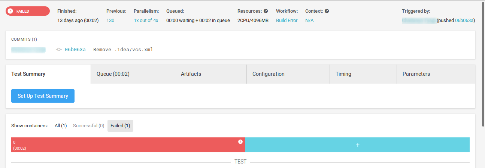
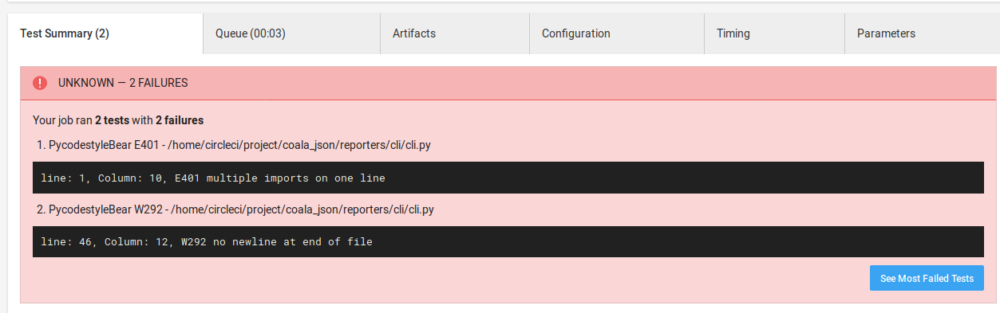
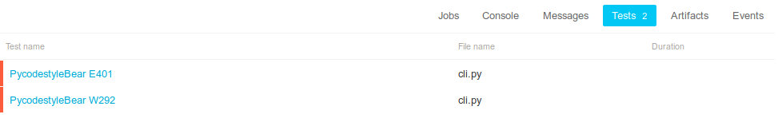

.. meta::
   :description: coala-json provides utilities to convert json format into
    various test result formats like Junit, CheckStyle, TAP etc.  
   :keywords:    coala-json, static code analysis, linter

=============================
The coala-json documentation!
=============================

.. toctree::
   :caption: Home
   :hidden:

   Welcome <self>

.. toctree::
   :caption: Help
   :hidden:

   How To Get In Touch With Us <Help/Getting_In_Touch>

You might also want to look at `coala's website <http://coala.io/>`_.

coala-json: tools for test reports integration
==============================================

**coala-json holds a collection of useful utilities that are used
to read JSON output and convert it to other formats.**

Result format inconsistencies have been a problem for a long time. Converting
the static analysis results into a test results format has been done a few 
times, such as early PEP8 plugins to Jenkins. The mapping isn’t exact, but the 
benefits of using the test result format are tight integration with various
CI/CD systems. This module will thus help you to convert your results in json 
format to many useful test results format easily.

Usually when your tests fail you have to look through the builds in search of
the failures but with our reporter tool your can see your test summary
automatically in front of you. After using the coala reporter tool your CI will
show test results
automatically in their respective *Tests* tab.

CircleCI:

AppVeyor:

Test Formats:
=============

JUnit
~~~~~

JUnit is the most popular test result report format which is used almost
everywhere. You can export code review result data to a file in JUnit XML
format easily. Jenkins, CircleCI, AppVeyor and many more analyse this
format directly and can convert the report into useful artifacts. You might
want to have a look at `Jenkins's JUnit graph <https://wiki.jenkins.io/display/JENKINS/JUnit+graph>`_.

Sample JUnit file:
~~~~~~~~~~~~~~~~~~

::

    <?xml version="1.0" encoding="utf-8"?>
    <testsuites>
    <testsuite package="PyLintBear" timestamp="2019-06-10T18:26:01.801875" tests="9" errors="9" name="/home/developer/coala-json/coala_json/TestOutput.py">
    <testcase name="PyLintBear C0111">
    <error message="line: 1, Column: 1, C0111 - Missing module docstring"></error>
    </testcase>
    </testsuite>
    </testsuites>

How to upload JUnit to CircleCI:
~~~~~~~~~~~~~~~~~~~~~~~~~~~~~~~~

To see test results as artifacts, you can add these to lines in your config
file.

``- store_test_results:``
    ``path: test-results``

Where the path key is an absolute or relative path to your working_directory
containing subdirectories of JUnit XML test metadata files. Make sure that
your path value is not a hidden folder (example: .my_hidden_directory would
be an invalid format).
After configuring CircleCI to collect your test metadata, tests that fail
most often appear in a list on the details page of Insights in the
application to identify flaky tests and isolate recurring issues.

You can also visit here: https://circleci.com/docs/2.0/collect-test-data/

How to upload JUnit to AppVeyor:
~~~~~~~~~~~~~~~~~~~~~~~~~~~~~~~~

Test results endpoint URL has the following format:
``https://ci.appveyor.com/api/testresults/{resultsType}/{jobId}``

where:
resultsType - test framework name to parse test results; supported parsers:

- mstest
- xunit
- nunit
- nunit3
- junit.

jobId - build job ID that is currently running; can be read from
APPVEYOR_JOB_ID environment variable.
Example build script in PowerShell that uploads Junit tests results in XML format:

::

    # upload results to AppVeyor
    $wc = New-Object 'System.Net.WebClient'
    $wc.UploadFile("https://ci.appveyor.com/api/testresults/junit/$(($env:APPVEYOR_JOB_ID)",
                   (Resolve-Path .\junit-results.xml))

You can also visit here:
https://www.appveyor.com/docs/running-tests/#uploading-xml-test-results

